# Werkplaats 2: MVC - Test Correct

## Overzicht
Dit project is een webapplicatie voor **Test-Correct** die helpt bij het taxonomeren van toetsvragen. De website maakt gebruik van **HTML, CSS, Javascript, Python, Sqlite, Flask, en Jinja** en heeft een **MVC-structuur**. De functionaliteiten omvatten CRUD-operaties, categorisatie van toetsvragen en een AI-systeem om prompts te testen.


## Wie zijn wij?

Wij zijn team **Skibidi** en ons team bestaat uit:
- **Max Hofman** (1103166)
- **Nosair Ahajam** (1063157)
- **Noortje Vroegop** (1100338)
- **Baset Ahmad** (1102300)
- **Daan Stuivenberg** (1112062)
- **David Tabachnik** (1090406)


## Functionaliteiten

- **CRUD functionaliteiten**: Functionaliteiten om data toe te voegen, aan te passen, af te lezen en te verwijderen in de database.
- **Vragenoverzicht**: Een overzicht van alle vragen die zijn opgeslagen in de database en een knoppen om vragen te importeren uit een JSON bestand en te exporteren.
- **Redacteurenoverzicht**: Een overzicht van alle redacteuren in de database. Met filter-, zoek- en sorteerfuncties.
- **Categoriseren**: Het categoriseren van vragen met de taxonomie van Bloom en RTTI.
---

## Installatiehandleiding
1. **Maak een venv aan**:

   ```bash
   python -m venv venv

   ```

2. **Venv activeren**:

   *Windows*
   ```bash
   venv/Scripts/activate
   ```
   *MacOS/ Linux*
    ```bash
   source venv/bin/activate
   ```
   *Windows met Bash*
    ```bash
   source venv/Scripts/activate
   ```

3. **Installeer afhankelijkheden**:

   ```bash
   pip install -r requirements.txt
   ```

4. **Start de ontwikkelingsserver**:

   ```bash
   python app.py
   ```

5.  **Wij bevelen Python verise 3.13 aan**:
   ```bash
   python --version
   ```

6. **ChatGPT key document**:
   Maak een text bestand aan die **gptkey.txt** heet en plaats je ChatGPT api-key in dit bestand.

**Open de website in je browser** op [http://127.0.0.1:5000].

## Inloggegevens

Je kunt inloggen met het standaard account:

*Admin*\
**Gebruikersnaam:** krugw@hr.nl\
**Wachtwoord:** geheim

*User*\
**Gebruikersnaam:** vried@hr.nl   
**Wachtwoord:** geheimer


Als **Admin** kun je gebruikers beheren, prompts verwijderen en aanpassen, terwijl **User** beperkte toegang heeft om prompts te gebruiken en te categoriseren.

## Introductie Website

Nadat je bent ingelogd, zie je de **Homepagina**. Op de homepagina kun je verschillende secties bereiken: **Vragen**, **AI Prompts**, **Redacteuren**, **Categoriseren** en **Taxonomie**. Je kunt naar deze secties gaan door op de links te klikken in de navigatiebalk. Als een vraag niet is gecategoriseerd, wordt dit op de homepagina aangegeven.


## Vragen Overzicht

Op de pagina **Vragen Overzicht** zie je een tabel met verschillende vragen. Je kunt nieuwe vragen uploaden in **JSON-formaat** door op *Choose File* te klikken, het bestand te selecteren en op de blauwe knop te drukken. Let op: Vragen moeten in JSON-formaat zijn. Bestaande vragen kunnen worden gezocht met de zoekbalk.

Vragen die al in de database staan, kunnen worden gedownload, bewerkt en verwijderd. Je kunt ook alle vragen tegelijk downloaden met de knop **Export Alle Vragen**. Daarnaast kun je nieuwe vragen toevoegen met de knop **Toevoegen**.


## AI Prompts

De **Promptoverview**-pagina biedt een overzicht van alle prompts die door redacteuren zijn aangemaakt. Deze pagina bevat een tabel met gedetailleerde informatie over de prestaties en het gebruik van elke prompt. 


### Tabelweergave
De tabel bevat de volgende kolommen:
- **Titel van de prompt**: De naam van de prompt, zoals aangemaakt door de redacteur.
- **Redacteur**: De naam van de redacteur die de prompt heeft aangemaakt.
- **Aantal vragen**: Het totale aantal vragen waarbij deze prompt is gebruikt.
- **Correct beantwoorde vragen**: Het aantal vragen dat correct is beantwoord met deze prompt.
- **Details**: Een knop die leidt naar de detailpagina van de geselecteerde prompt voor meer informatie.

### Sorteeroptie
- **Sorteer op titel**: Een sorteeroptie waarmee je prompts kunt filteren op basis van hun titel. Dit maakt het eenvoudig om specifieke prompts snel te vinden.

Met deze pagina kunnen redacteuren en gebruikers eenvoudig inzicht krijgen in de prestaties en het gebruik van hun prompts. De detailsknop maakt het mogelijk om diepgaandere analyses uit te voeren.

### Knop voor prompt aanmaken
- **Prompt aanmaken**: Onder de tabel bevindt zich een knop waarmee je naar de **Prompt Aanmaak**-pagina wordt geleid.  
  Op deze pagina kun je:  
  - **Prompttitel aanmaken**: Een unieke titel geven aan de nieuwe prompt.  
  - **Prompt zelf opstellen**: De inhoud van de prompt definiëren.  
    Deze prompt wordt later gebruikt door AI om vragen te categoriseren. 


## Prompt Detail Pagina


De **Prompt Detail**-pagina toont specifieke informatie over een geselecteerde prompt.  

### Functionaliteiten
- **Promptinformatie**: Een overzicht van de titel, de redacteur, en eventuele aanvullende details over de prompt.  
- **Verwijderknop**: Een knop waarmee je de prompt permanent kunt verwijderen.  
  - Bij het klikken op de knop verschijnt er eerst een waarschuwing om te bevestigen of je zeker weet dat je de prompt wilt verwijderen.  
  - Als je bevestigt door op "Ja" te klikken, wordt de prompt permanent verwijderd.  

   Deze pagina biedt een gedetailleerde weergave van een individuele prompt en maakt het beheren ervan eenvoudig.


## Categoriseringspagina 
De **Categoriseringspagina** biedt een interface om vragen te categoriseren met behulp van AI.  

### Functionaliteiten
- **Dropdown-menu's**: Op deze pagina zijn er vier dropdown-menu's beschikbaar:  
  1. **Vragen**: Kies een specifieke vraag die je wilt categoriseren.  
  2. **Prompts**: Selecteer een prompt die gebruikt zal worden bij de categorisatie.  
  3. **Taxonomieën**: Kies een taxonomie die bepaalt binnen welke categorieën de vraag valt.  
  4. **AI-model**: Selecteer het AI-model dat gebruikt wordt voor de categorisatie.  

- **Actieknop**: Nadat je alle items hebt geselecteerd (vraag, prompt, taxonomie, en AI-model), klik je op de **"Genereren"**-knop.  
  - Deze knop activeert het AI-model om de gekozen vraag te analyseren en te categoriseren op basis van de ingestelde criteria.  

## Gecategoriseerde Vraag
Na het klikken op **Genereren** kom je op de pagina voor de **Gecategoriseerde Vraag**. Hier zie je het resultaat van de AI-analyse:  

- **Categorie**: De categorie die door het AI-model is voorgesteld voor de geselecteerde vraag.  
- **Uitleg**: Een korte uitleg van het AI-model over waarom de vraag in deze categorie valt.  
- **JSON-bestand**: Onder de uitleg wordt het JSON-bestand getoond met de gegevens die de AI heeft gegenereerd.

### Keuzeopties
Na het bekijken van de gecategoriseerde vraag kun je een van de volgende acties ondernemen:  
- **Goedkeuren**: Als je het eens bent met de voorgestelde categorisatie, klik je op **Goedkeuren**. Dit stuurt de gecategoriseerde vraag naar de database en brengt je terug naar de **Categoriseringspagina**.  
- **Afwijzen**: Als je het niet eens bent met de categorisatie, klik je op **Afwijzen**. Dit verwijdert de gegenereerde JSON en brengt je terug naar de **Categoriseringspagina** zonder de categorisatie op te slaan.  

Deze stappen helpen je om nauwkeurig de juiste categorisatie goed te keuren of af te wijzen.


## Redacteuren
Op de **Redacteuren** pagina kun je bestaande editors filteren op naam en login. Je kunt ook filteren op admin- en niet-admin-gebruikers. Als je adminrechten hebt, kun je bestaande gebruikers bewerken en verwijderen. Je kunt ook je eigen gegevens bewerken met de knop **Wijzig eigen gegevens** en nieuwe redacteuren/gebruikers aanmaken met de groene knop **Nieuwe Redacteur**.


## **Assets**
- **Logo**: [Test-Correct](https://www.test-correct.nl/)
- **Font**: [Google Fonts](https://fonts.google.com/specimen/Nunito?query=nunito)
- **Icons**: [Ionicons](https://ionic.io/ionicons)

## **Code Bronnen**
- **YouTube Tutorials**
  - [Dynamic Tables](https://www.youtube.com/watch?v=mCy52I4exTU)
  - [Python Website](https://www.youtube.com/watch?v=dam0GPOAvVI)
  - [Uploading Files](https://youtu.be/pPSZpCVRbvQ?si=Ms8js7b4a-PkuVba)
  - [Filter Data](https://youtu.be/d3F5DlrpD28?si=xFsyl192OZ-L1zpC)
  - [Sessions](https://youtu.be/iIhAfX4iek0?si=cZPaAfCVD-KMiVA5)
  - [Messages](https://www.youtube.com/watch?v=abCSKRMGZ3A)
  - [MVC](https://www.youtube.com/watch?v=DUg2SWWK18I)
  - [Password Storage](https://www.youtube.com/watch?v=qgpsIBLvrGY)
  - [Pagination](https://youtu.be/U18hO1ngZEQ?si=e7YMcLeT5wGR5TPQ)

- **Web Resources**
   -  [Flask App Routing - GeeksforGeeks](https://www.geeksforgeeks.org/flask-app-routing/)  
   - [Build a To-Do List App Using Python Flask, Jinja2, and SQL - Lovelace Coding](https://lovelacecoding.hashnode.dev/build-a-to-do-list-app-using-python-flask-jinja2-and-sql)  
   - [Adding Bootstrap to Flask - Tech With Tim](https://www.techwithtim.net/tutorials/flask/flask-adding-bootstrap)  
   - [HTML Tutorial - W3Schools](https://www.w3schools.com/html/)  
   - [CSS Units Reference - W3Schools](https://www.w3schools.com/cssref/css_units.php)  
   - [Build a Web App Using Flask and SQLite in Python - GeeksforGeeks](https://www.geeksforgeeks.org/how-to-build-a-web-app-using-flask-and-sqlite-in-python/)  
   - [How to Use CSS in Python Flask - GeeksforGeeks](https://www.geeksforgeeks.org/how-to-use-css-in-python-flask/)  
   - [Ionicons Usage - Ionic](https://ionic.io/ionicons/usage)  
   - [SQLite ALTER TABLE Statement - TechOnTheNet](https://www.techonthenet.com/sqlite/tables/alter_table.php)  
   - [FastAPI Jinja Login - FastAPI Tutorial](https://www.fastapitutorial.com/blog/fastapi-jinja-login/)  
   - [Creating a Login Page in Flask - Real Python](https://realpython.com/introduction-to-flask-part-2-creating-a-login-page/)  
   - [Understanding Joins in SQL - Launch School](https://launchschool.com/books/sql/read/joins)  
   - [Protecting Endpoints in Flask Apps - Teclado](https://blog.teclado.com/protecting-endpoints-in-flask-apps-by-requiring-login/)  
   - [Convert JSON to SQLite in Python - DEV Community](https://dev.to/kamranakhan/python-convert-json-to-sqlite-4a5n)  
   - [Creating Popups in Python - PopupSmart](https://popupsmart.com/blog/python-popup)  
   - [Flask Quickstart - Flask Documentation](https://flask.palletsprojects.com/en/stable/quickstart/)  
   - [Flashing Patterns in Flask - Flask Documentation](https://flask.palletsprojects.com/en/stable/patterns/flashing/)  
   - [Customizing Error Pages in Flask - DEV Community](https://dev.to/dev0928/how-to-customize-python-flask-web-application-error-pages-3b25)  
   - [Python JSON Tutorial - W3Schools](https://www.w3schools.com/python/python_json.asp)  
   - [JSON Library in Python - Python Docs](https://docs.python.org/3/library/json.html)  
   - [Handling HTTP Methods in Flask - GeeksforGeeks](https://www.geeksforgeeks.org/flask-http-methods-handle-get-post-requests/)  
   - [SQLite with Python - SQLite Tutorial](https://www.sqlitetutorial.net/sqlite-python/)  


## Screenshots van de website
Hieronder zie je enkele afbeeldingen van de website:

- **Inlogpagina**  
  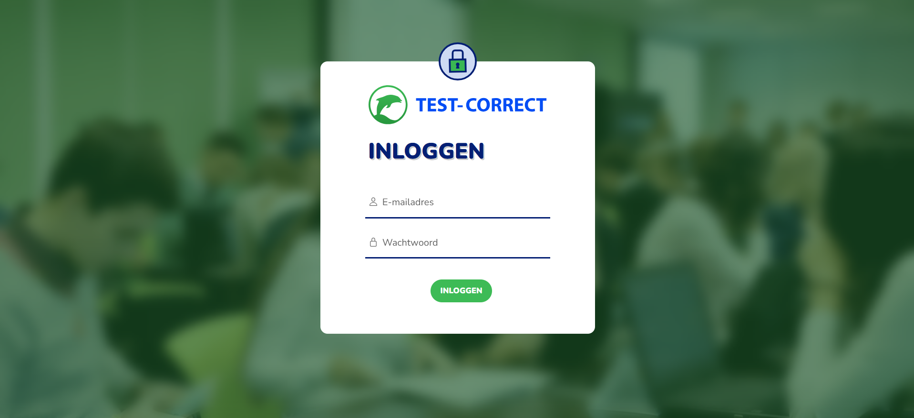

- **Homepagina**  
  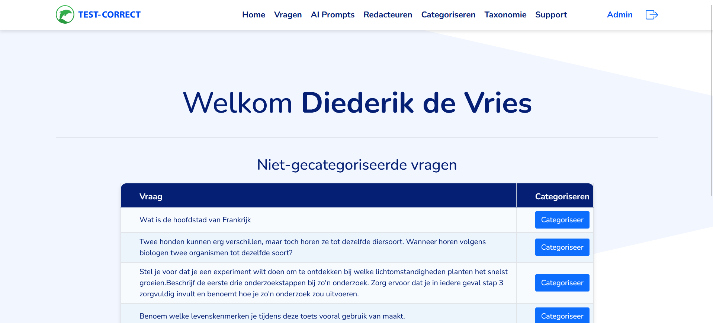

- **Vragen Overzicht**  
  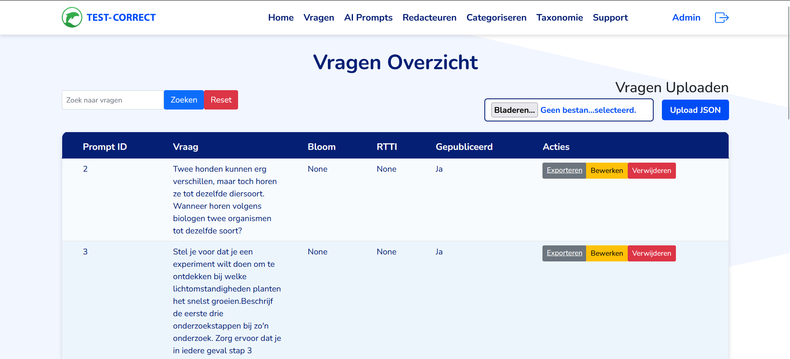

- **AI Prompt Overzicht**  
  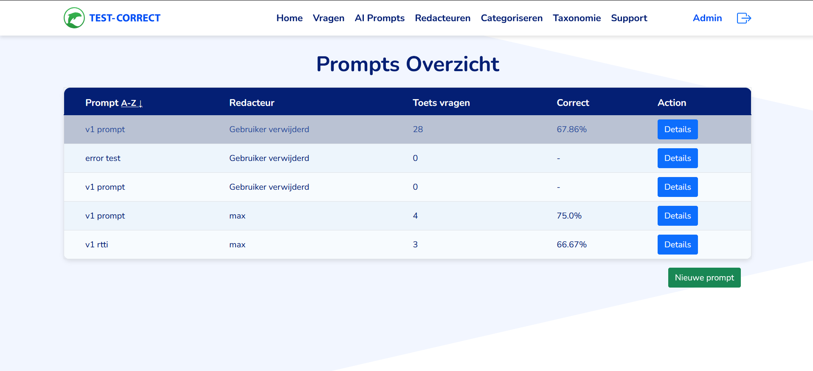

- **Prompt Details**  
  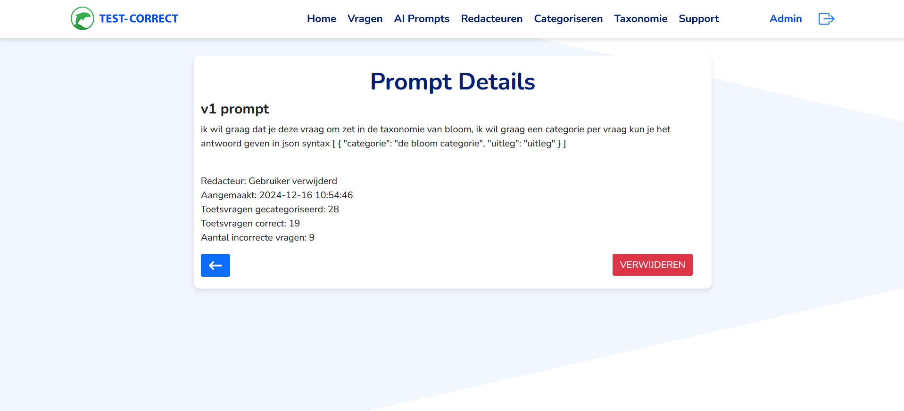

- **Redacteuren**  
  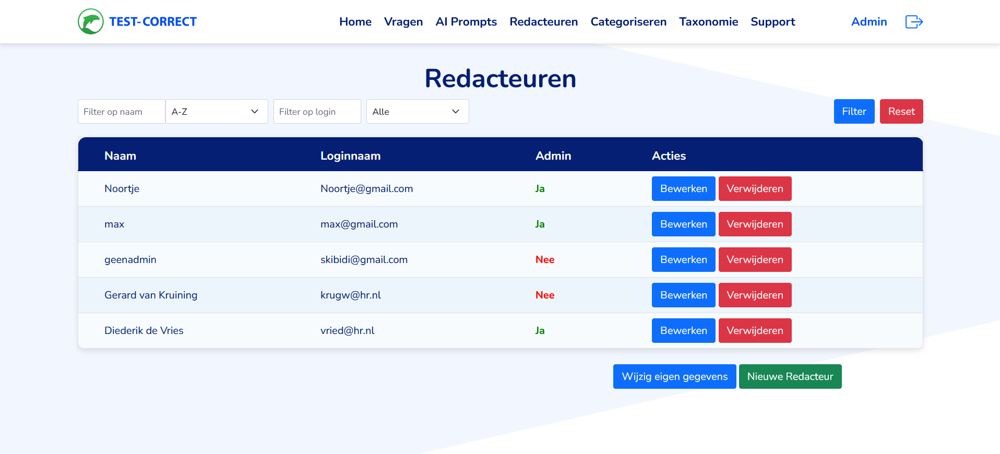

- **Redacteur Wijzigen**  
  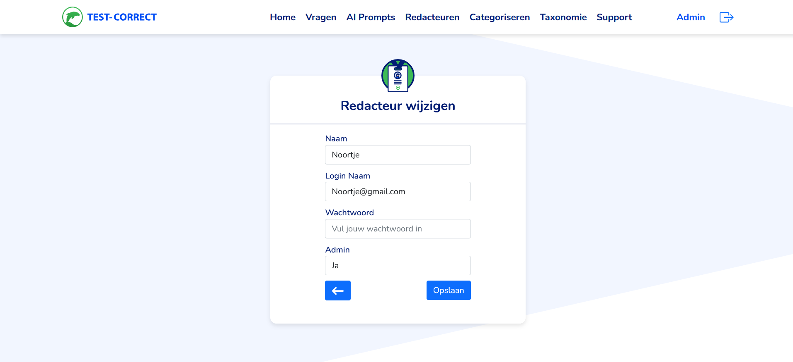

- **Vragen Categoriseren**  
  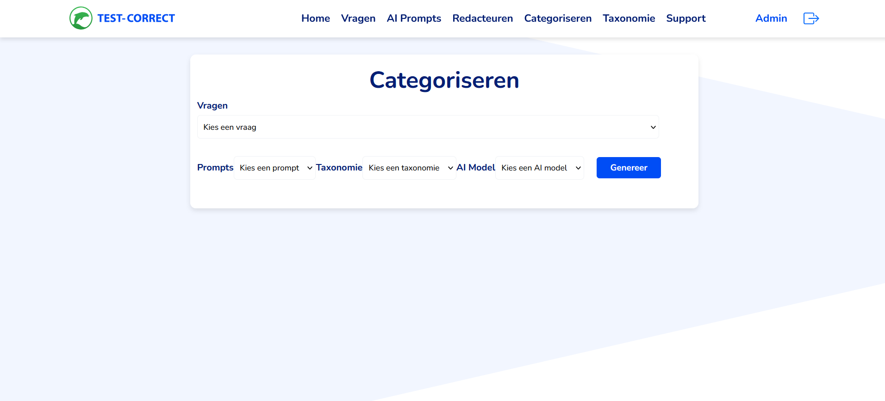

- **Taxonomie**  
  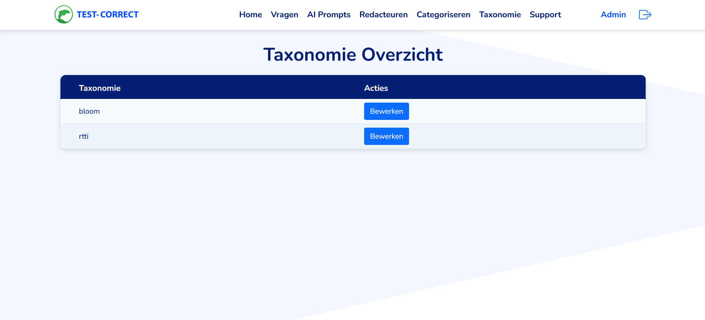

- **Support**  
  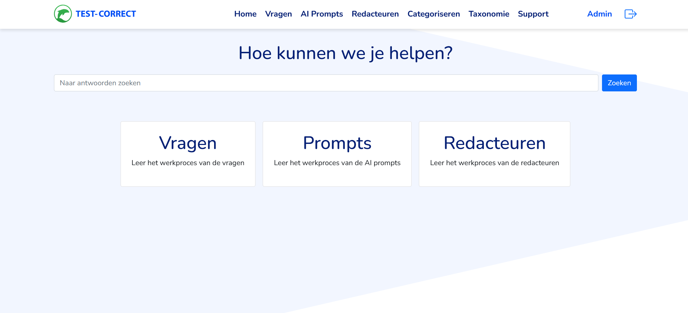

- **Geen Toegang**  
  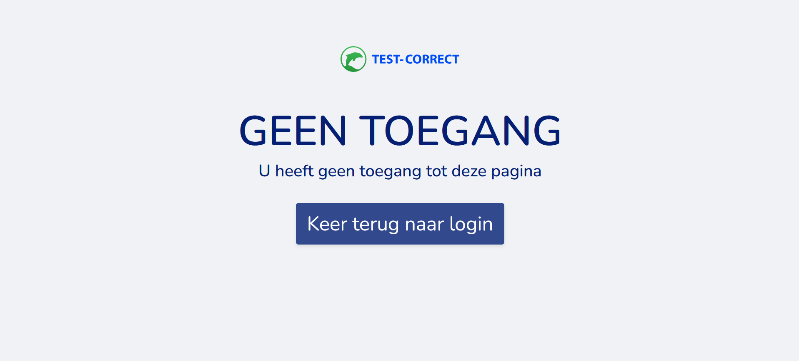

